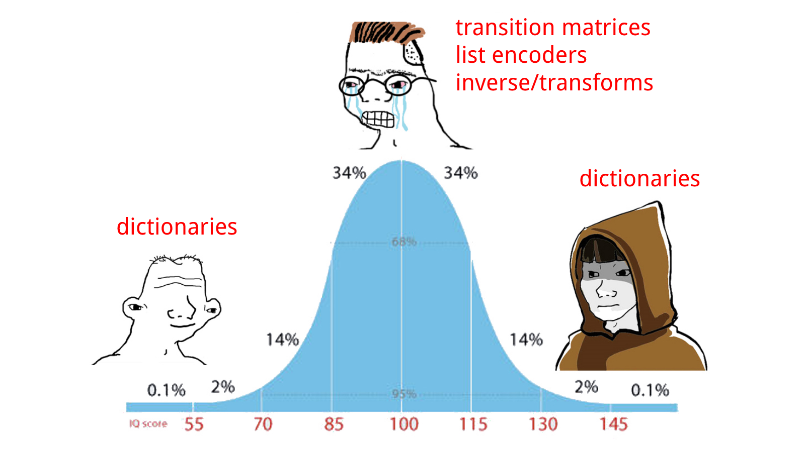

<div align="center">
  
</div>
<div align="center">
</div>


### About

marc is a **Mar**kov **c**hain generator for Python and/or Swift


### Python

Install<sup>‡</sup>

```sh
pip install marc
```


Quickstart:

```python
from marc import MarkovChain

player_throws = "RRRSRSRRPRPSPPRPSSSPRSPSPRRRPSSPRRPRSRPRPSSSPRPRPSSRPSRPRSSPRP"
sequence = [throw for throw in player_throws]
# ['R', 'R', 'R', 'S', 'R', 'S', 'R', ...]

chain = MarkovChain(sequence)
chain.update("R", "S")

chain["R"]
# {'P': 0.5, 'R': 0.25, 'S': 0.25}

player_last_throw = "R"
player_predicted_next_throw = chain.next(player_last_throw)
# 'P'

counters = {"R": "P", "P": "S", "S": "R"}
counter_throw = counters[player_predicted_next_throw]
# 'S'
```

For more inspiration see the [python/examples/](python/examples/) directory


### Swift

SPM:

```swift
dependencies: [
    .package(url: "https://github.com/maxhumber/marc.git", .upToNextMajor(from: "3.0"))
]
```


Quickstart:

```swift
import Marc

let playerThrows = "RRRSRSRRPRPSPPRPSSSPRSPSPRRRPSSPRRPRSRPRPSSSPRPRPSSRPSRPRSSPRP"
let sequence = playerThrows.map { String($0) }

let chain = MarkovChain(sequence)
chain.update("R", "S")

print(chain["R"])
// [("P", 0.5), ("R", 0.25), ("S", 0.25)]

let playerLastThrow = "R"
let playerPredictedNextThrow = chain.next(playerLastThrow)!

let counters = ["R": "P", "P": "S", "S": "R"]
let counterThrow = counters[playerPredictedNextThrow]!
print(counterThrow)
// "S"
```

For more inspiration see the [swift/Examples/](swift/Examples/) directory


### API/Comparison

|                         | Python                                 | Swift                                      |
| ----------------------- | -------------------------------------- | ------------------------------------------ |
| Import                  | `from marc import MarkovChain`         | `import Marc`                              |
| Initialize <sub>A</sub> | `chain = MarkovChain()`                | `chain = MarkovChain<String>()`            |
| Initialize <sub>B</sub> | `chain = MarkovChain(["R", "P", "S"])` | `let chain = MarkovChain(["R", "P", "S"])` |
| Update chain            | `chain.update("R", "P")`               | `chain.update("R", "P")`                   |
| Lookup transitions      | `chain["R"]`                           | `chain["R"]`                               |
| Generate next           | `chain.next("R")`                      | `chain.next("R")!`                         |


### Why

I built the first versions of *marc* in the Fall of 2019. Back then I created, and used, it as a teaching tool (for how to build and upload a PyPI package). Since March 2020 I've been spending less and less time with Python and more and more time with Swift... and so, just kind of forgot about *marc*.

Recently, I had an iOS project come up that needed some Markov chains. After surveying GitHub and not finding any implementations that I liked (forgetting that I had already rolled my own in Python) I started from scratch on a new implementation in Swift. 

Just as I was finishing the Swift package I re-discovered *marc*... I had a good laugh looking back through the [original](https://github.com/maxhumber/marc/tree/5ea21639aba16fcfe15c5de25049d024e0bb3332) Python library. My feelings about the code I wrote and my abilities in 2019 can be summarized in a picture:

<div align="center">
	
</div>


Unable to resist a good procrasticode™ project, I cross-ported the finished Swift package to Python and polished up both codebases and documentation into this mono repo. 

Honestly, I had a lot of fun trying to mirror the APIs as closely as possible while doing my best to keep the Python code "Pythonic" and the Swift code "Schwifty". The whole project and exercise was incredibly rewarding, interesting, insightful. Crudely, here's how found working on both codebases:

**Python**

| Like                                | Dislike                                  |
| ----------------------------------- | ---------------------------------------- |
| `defaultdict` !!                    | Clunky `setup.py` packaging              |
| `random.choice` !                   | Setting up and working with environments |
| Dictionary comprehensions + sorting | `__init__.py` and directory issues       |

**Swift**

| Like                                              | Dislike                                        |
| ------------------------------------------------- | ---------------------------------------------- |
| `Package.swift` and packaging in general          | Dictionary performance sucks... (surprising!!) |
| Don't have to think about environments            | Need randomness? Too bad. Go roll it yourself  |
| `XCTest` is nicer/easier than `unittest`/`pytest` | Playgrounds aren't as good as Hydrogen/Jupyter |

So why? For fun! And procrastination. And, more seriously, because I needed some chains in Swift. And then, because I thought it could be interesting to create a Rosetta Stone for Python and Swift... So if you, Dear Reader, are looking to use Markov chains in your Python or Swift project, or are looking to jump to or from either language, I hope you find this useful.


### Warning

<sup>‡</sup> marc 3.0+ is incompatible with marc 2.x
