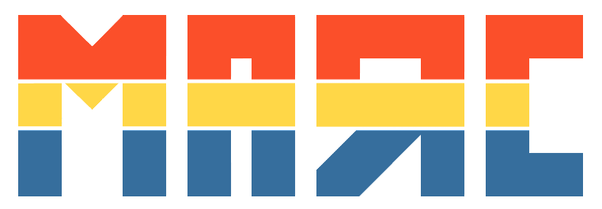
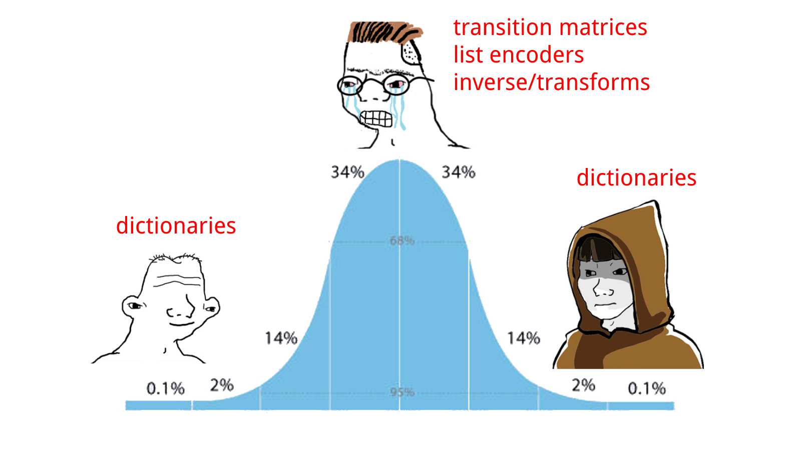

<h3 align="center">
  
</h3>
<p align="center">
  <a href="https://travis-ci.org/maxhumber/marc"></a>
  <a href="https://pypi.python.org/pypi/marc"></a>
</p>


### About

marc is a **mar**kov **c**hain python library and swift package


### Python

Install:

```sh
pip install -U marc
```

<sup>⚠️ marc 3.0+ is incompatible with marc 2.x</sup>


Quickstart:

```python
from marc import MarkovChain

player_throws = "RRRSRSRRPRPSPPRPSSSPRSPSPRRRPSSPRRPRSRPRPSSSPRPRPSSRPSRPRSSPRP"
sequence = [throw for throw in player_throws]
# ['R', 'R', 'R', 'S', 'R', 'S', 'R', ...]

chain = MarkovChain(sequence)
chain.update("R", "S")

chain["R"]
# {'P': 0.5, 'R': 0.25, 'S': 0.25}

player_last_throw = "R"
player_predicted_next_throw = chain.next(player_last_throw)
# 'P'

counters = {"R": "P", "P": "S", "S": "R"}
counter_throw = counters[player_predicted_next_throw]
# 'S'
```

For more inspiration see the [python/examples/](CHANGEME) directory


### Swift

SPM:

```swift
dependencies: [
    .package(url: "https://github.com/maxhumber/marc.git", .upToNextMajor(from: "3.0"))
]
```


Quickstart:

```swift
import Marc

let playerThrows = "RRRSRSRRPRPSPPRPSSSPRSPSPRRRPSSPRRPRSRPRPSSSPRPRPSSRPSRPRSSPRP"
let sequence = playerThrows.map { String($0) }

let chain = MarkovChain(sequence)
chain.update("R", "S")

print(chain["R"])
// [("P", 0.5), ("R", 0.25), ("S", 0.25)]

let playerLastThrow = "R"
let playerPredictedNextThrow = chain.next(playerLastThrow)! // << returns optional
// "P"

let counters = ["R": "P", "P": "S", "S": "R"]
let counterThrow = counters[playerPredictedNextThrow]! // << returns optional
print(counterThrow)
// "S"
```

For more inspiration see the [swift/examples/](CHANGEME) directory


### API/Comparison

|                                         | Python                                 | Swift                                      |
| --------------------------------------- | -------------------------------------- | ------------------------------------------ |
| **Initialize**                          | `chain = MarkovChain()`                | `chain = MarkovChain<String>()`            |
| **Initialize** (with starting sequence) | `chain = MarkovChain(["R", "P", "S"])` | `let chain = MarkovChain(["R", "P", "S"])` |
| **Update** chain                        | `chain.update("R", "P")`               | `chain.update("R", "P")`                   |
| **Lookup** possible transitions         | `chain["R"]`                           | `chain["R"]`                               |
| Generate **next**                       | `chain.next("R")`                      | `chain.next("R")!`                         |


### Evolution

⚠️ **WIP**

- Evolution can be summed up in a picture:



- First written in python

  - In the before times

- Used as a teaching tool for python packaging...

- Actual code was heavily inspired by existing implementations...

  - Didn't actually stop and try to build my own from scratch.
    - Linked to a limited understanding for how chains actually worked
  - First versions were way too fancy
    - See commit:  5ea21639aba16fcfe15c5de25049d024e0bb3332
    - I was obsessed with reimplementing sklearn transformers, for some reason?

- Since March 2020 I've been spending more and more time with Swift

  - Less and less time in python...

- Needed to implement a markov chain for a client project in Swift

  - Knew I had marc (untouched since 2020)...
    - Wanted to try to write from scratch
      - Found it was way easier to just to dictionary lookup

- After swift version implemented, went back and redid python

  - Found a way simpler and more performant version

- Wanted to make the APIs match as closely as possible

  - (Especially at the call sight)
    - But be as pythonic as possible with the python
    - And as swifty as possible with the swift

- Now serve as a Rosetta Stone

  - Learning swift and writing production swift has made me a better python programmer
    - (The reverse is also true!)

- What I think about each

  - Good Python:
    - `Random.choice`
    - Dictionary insertion is way faster? Surprising?? Need to figure out why?
    - Ability to sort dictionaries
    - Pytest `assert` is cleaner...
  - Bad python:
    - setup.py is just worse...
    - Dev environment (vent) is a buzzkill
    - Issues with jupyter/atom + pytest (still unresolved)

  - Good swift:
    - Packaging is way easier
    - Dev environment is something you don't even have to think about
    - Types! (I know python has 'em but they're really not the same at all...)
    - Generics
    - XCTest sitting right beside the code
  - Bad swift: 
    - Playgrounds are slow...
    - Adding resources to playgrounds is harder
    - No random? Had to roll my own (not bad, but a little surprising tbh)

- How has swift made me a better developer?

  - Less reliance on third party packages
  - More intentional api design and exposure with `public`
  - More testing, because it's actually integrated
  - Functional programming 
